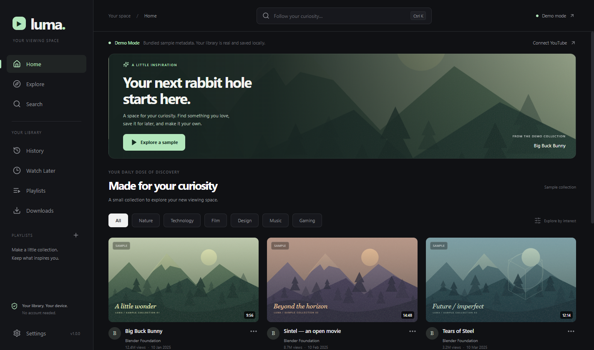

# Luma

**A desktop home for your YouTube curiosity.** Search, watch, and build a library that lives on your computer.

Luma is an independent open-source Electron application. It uses the official YouTube Data API for discovery and the official YouTube IFrame Player for playback. No YouTube account is required. It is not affiliated with YouTube or Google.



## Features

- Dark, light, and system themes; adjustable interface scale.
- Search videos, channels, and playlists with pagination, upload-date and duration filters, and supported sort orders. Channel and online playlist results open on YouTube.
- Official embedded player, normal YouTube controls, fullscreen, volume, playback speed, and keyboard shortcuts.
- SQLite watch history with resume positions, search history, Watch Later with custom ordering and watched status, and local playlists.
- App-owned promotional filtering with block/allow rules, text, domains, safe wildcard patterns, and restricted cosmetic selectors. Import/export rules as JSON.
- Clearly labeled, offline-browsable Demo Mode with bundled original sample artwork and illustrative metadata.
- API caching, useful network/quota errors, encrypted API-key storage where the operating system supports it, and a read-only GitHub release checker.

## Requirements

For development: **Node.js 22.12 or newer**, npm, and Git. Windows 10/11 x64 is the primary target. Internet is needed for initial dependency installation, live YouTube results, and playback. No Python, C++ toolchain, or external database server is needed: SQL.js bundles the actual SQLite engine as WebAssembly in the main process.

For the built application: install the Windows installer. Node.js and npm are not required on the end user's computer.

macOS and Linux have build targets and portable application code but have not been validated on those operating systems. Build each platform on its own host. macOS distribution additionally needs signing/notarization.

## Install and run from source

```sh
git clone https://github.com/EpicGamer1599/Luma.git
cd Luma
npm install
npm run dev
```

The desktop window opens immediately in Demo Mode if no key is configured. Vite updates the React interface while developing. Restart `npm run dev` after changing main-process or preload code.

This source tree does not assume a GitHub owner. After publishing, replace the clone URL above and set the real `owner/repository` under Settings → About.

## YouTube API key setup

1. Create or select a project in [Google Cloud Console](https://console.cloud.google.com/).
2. Enable [YouTube Data API v3](https://console.cloud.google.com/apis/library/youtube.googleapis.com).
3. Create an API key and restrict its API access to YouTube Data API v3. Desktop main-process requests are not website requests, so browser HTTP-referrer restrictions may reject them. Use restrictions appropriate to your environment and monitor your project's usage.
4. Open Settings → YouTube connection, enter the key, and choose **Save key**.
5. Turn **Demo Mode off**. The next search uses the live API.

Alternatively, copy `.env.example` to `.env`, set `YOUTUBE_API_KEY`, and restart development. Environment keys stay in the main process and are never bundled into frontend JavaScript. A saved encrypted key takes priority. Removing it falls back to an environment key, if set.

Keys saved through Settings use Electron `safeStorage` (Windows DPAPI on Windows). When secure OS storage is unavailable, Luma refuses to save a plaintext key; use a local environment configuration instead. A personal desktop key is not a server secret: a user controlling the computer can recover it. Never distribute a shared key or commit `.env`.

Playback itself does **not** require a Data API key. YouTube still controls video availability, regional restrictions, embedding permissions, authentication requirements, and advertising. Luma does not bypass them.

## Development and verification

```sh
npm run typecheck
npm test
npm run test:e2e
```

- Unit and component tests cover API parsing, failures, cache behavior, database operations, persistence, corruption recovery, history/privacy, Watch Later, playlists, settings, filtering, IPC validation, and React UI actions.
- End-to-end tests launch a real Electron window, use the UI, and restart against an isolated SQLite library. They require a graphical desktop; Linux CI uses Xvfb. Playwright uses Electron's Chromium, so no separate browser installation is necessary.
- Automated tests do not require credentials. Remote playback and a real API key require a separate manual integration check. See [verification notes](docs/VERIFICATION.md).
- `npm run compile` creates application bundles without an installer; `npm start` launches those bundles.
- `node scripts/generate-assets.mjs` regenerates the original bundled vector artwork and app icons.

## Build an installer

On Windows:

```sh
npm run build
```

The NSIS installer is written to `release/Luma Setup 1.0.0.exe`. It supports a per-user installation, a selectable install directory, Start menu entry, desktop shortcut, and uninstallation. An unpacked application is also created at `release/win-unpacked/Luma.exe`.

```sh
npm run build:dir
```

This creates an unpacked application only. On a macOS or Linux host, `npm run build` selects the configured DMG or AppImage target. See [release instructions](docs/RELEASING.md) before publishing binaries.

Windows builds in this repository are **unsigned**. Production publishers should configure trusted code signing; Windows may warn about an unsigned installer. GitHub Actions builds Windows installers and uploads artifacts, but never publishes automatically.

To repeat the desktop tests against the packaged executable in PowerShell:

```powershell
$env:LUMA_TEST_EXE = (Resolve-Path 'release/win-unpacked/Luma.exe').Path
npm run test:packaged
Remove-Item Env:LUMA_TEST_EXE
```

## Configuration and local data

Settings covers theme/scale, initial player volume/speed, autoplay, history privacy, filtering, data clearing, and About/Updates. No configuration file is required.

The library is a genuine SQLite file named `library.sqlite` in Electron's user-data directory (normally `%APPDATA%/luma-youtube-client` during source development and `%APPDATA%/Luma` when packaged). Close Luma before copying this file for a backup. `LUMA_DATA_DIR` can point to a separate user-data directory for testing or portable library experiments. Do not use the same data directory from two simultaneous processes.

The schema is versioned with `PRAGMA user_version`. Parameterized queries, foreign keys, transactions, and atomic file replacement protect normal writes. SQL.js keeps the library in memory and exports it after mutations; very large libraries may eventually benefit from a native SQLite backend. An unreadable database is preserved as `library.sqlite.corrupt-<timestamp>` and a fresh database is created with a visible notice. Disk permission errors stop a write rather than silently reporting success.

Preferences and local collections never sync to a YouTube account. API response caching is in memory, bounded to 100 entries and ten minutes, with concurrent request deduplication. Discovery does not poll. Local metadata persists while referenced by a collection; opening a live video refreshes its metadata. Playback positions are written when playing, pausing, leaving the page, and at most every ten seconds while playing. They are approximate, not guaranteed frame-accurate.

## Filtering

Default rules hide only Luma-owned elements labeled as sponsored cards, banners, affiliate cards, advertisements, or overlays. Luma currently shows no real advertising. Settings contains a clearly labeled sample element so the filtering behavior can be inspected.

Advanced filtering can hide discovery cards by text, domain, or wildcard pattern. `*` matches any sequence and `?` one character. Allow rules override matching block rules. Disabling filtering bypasses all rules; disabling advanced filtering retains cosmetic rules only. Saved collections remain accessible even if a discovery filter would hide a video.

```json
[
  {
    "id": "no-promotions",
    "action": "block",
    "kind": "text",
    "value": "sponsored",
    "enabled": true
  },
  {
    "id": "trusted-topic",
    "action": "allow",
    "kind": "pattern",
    "value": "*open source*",
    "enabled": true
  },
  {
    "id": "app-banner",
    "action": "block",
    "kind": "cosmetic",
    "value": "[data-promotion=\"banner\"]",
    "enabled": true
  }
]
```

Cosmetic selectors are deliberately restricted to `[data-promotion="..."]` for the five app-owned categories. Arbitrary CSS is never injected. No rules are applied to YouTube iframes, requests, streams, or ads. Import loads rules into the editor; **Save rules** applies them. Export downloads the last saved rules.

## Keyboard shortcuts

| Shortcut                | Action         |
| ----------------------- | -------------- |
| Space                   | Play / pause   |
| Left / Right            | Seek 5 seconds |
| F                       | Fullscreen     |
| M                       | Mute / unmute  |
| Ctrl+K (Cmd+K on macOS) | Focus search   |
| Ctrl+H (Cmd+H on macOS) | Open history   |

Typing in inputs does not trigger playback shortcuts. When the YouTube iframe has keyboard focus, YouTube handles its own controls. Browser restrictions may require a user gesture for autoplay or fullscreen.

## Troubleshooting

- **No key / invalid key:** use Demo Mode, or enable YouTube Data API v3 and check the key's API and application restrictions in Google Cloud.
- **Quota or rate limit:** wait for your quota to reset, review Google Cloud usage, or use local collections/Demo Mode. Luma does not retry continuously. Consult [current quota documentation](https://developers.google.com/youtube/v3/getting-started#quota) for your project's limits.
- **No internet:** bundled demos and the local library remain available. Live thumbnails/results and playback require a connection.
- **Private, deleted, or non-embeddable video:** use Open on YouTube. Luma cannot restore unavailable content or override a creator's playback settings.
- **Player error 153:** the official embed requires client identification through an HTTP Referer. Luma serves its bundled UI from a loopback HTTP origin and keeps `strict-origin-when-cross-origin`. Network filters or changes in YouTube's accepted client identification can still prevent playback; open the video on YouTube. Do not disable web security or bypass restrictions.
- **A blank window:** run `npm run compile` and `npm start`, or use `npm run dev`. Opening `index.html` directly is not supported. Check that another development server is not occupying port 5173.
- **Database failure:** check free disk space and permissions. Close the app, back up `library.sqlite`, and restore a known-good copy. To start fresh manually, rename that file rather than deleting your only copy. A corrupt-file backup is never automatically deleted.
- **Invalid filter file:** use the documented JSON format, unique IDs, a maximum of 500 rules / 250 KB, and only supported cosmetic selectors.
- **Build download failures:** allow npm, GitHub's Electron releases, and electron-builder binary downloads through your proxy/firewall. Dependencies are pinned by `package-lock.json`; CI uses `npm ci`.
- **Linux key storage:** install/configure an OS secret store. Plaintext fallback storage is not accepted for saved keys.

## Project structure

```text
electron/
  main.ts                 Window lifecycle, local asset server, IPC handlers
  preload.ts              Single narrow, context-isolated bridge
  security.ts             IPC and external-link validation
  database/library.ts     SQLite schema, transactions, recovery, collections
  youtube/client.ts       Official Data API, parsing, caching, errors
src/
  App.tsx                 Navigation and shared application state
  components/             Player, cards, grids, dialogs
  pages/                  Discovery, library, video, settings
  filtering/              App-only rule engine
  hooks/                  Typed bridge and formatting helpers
  shared/                 Validated schemas, types, demo metadata
  styles.css              Theme tokens and responsive desktop styling
public/demo/              Original offline sample artwork
scripts/                  Development, compilation, asset generation
build/                    Installer icons
tests/                    Unit, component, and Electron integration tests
.github/workflows/        CI and Windows installer artifacts
docs/                     Architecture, release, and verification notes
```

## Security and privacy

The renderer runs with context isolation and sandboxing, without Node integration. IPC validates both sender frame/origin and payload. Remote code has no bridge. External links are HTTPS-only with a fixed hostname allowlist; popup creation and app navigation are restricted. The production Content Security Policy contains no unsafe eval or inline scripts. A loopback server serves bundled static files only and exposes no mutation or data endpoints.

The API key is never returned through IPC, embedded in renderer bundles, or included in app error messages. YouTube receives live API requests and player traffic. GitHub receives a release request only after you click Check for updates. Luma includes no analytics. See [SECURITY.md](SECURITY.md) for reporting guidance.

## Contributing

Read [CONTRIBUTING.md](CONTRIBUTING.md). Keep changes focused, add meaningful tests for behavior, and run typechecking, tests, and the build before opening a pull request. Preserve the official-player boundary and keep secrets out of commits.

## Intentionally excluded

No YouTube audiovisual downloads, ad blocking inside YouTube, DRM circumvention, media extraction, account synchronization, personalized YouTube recommendations, or automatic executable updates. The Downloads page explains this clearly. Related videos are on-demand topic matches from official search, not YouTube's personalized recommendations.

Demo dates, view counts, artwork, and descriptions are illustrative and are not represented as live results. Its six sample video IDs refer to real videos, whose current availability is controlled by YouTube. Demo channel/playlist search is intentionally empty with a setup explanation.

MIT licensed; see [LICENSE](LICENSE). YouTube names and trademarks belong to their owners. Bundled demo artwork is original to this project and covered by the project license.
